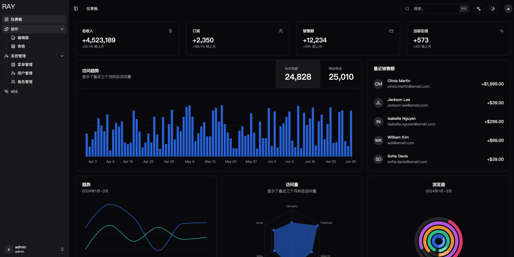
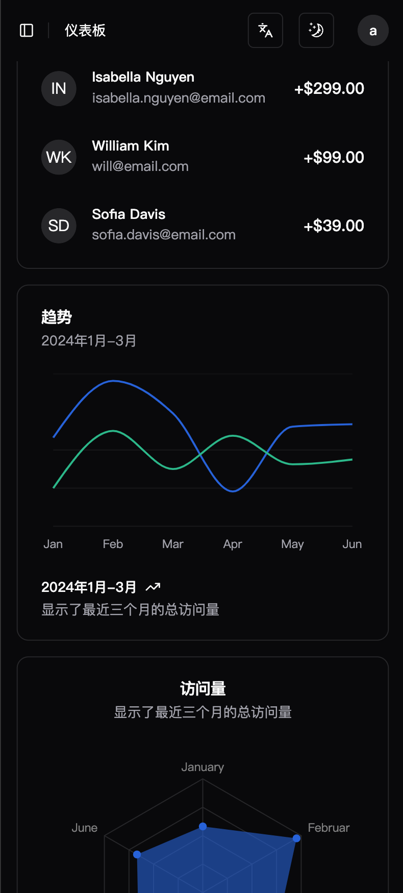
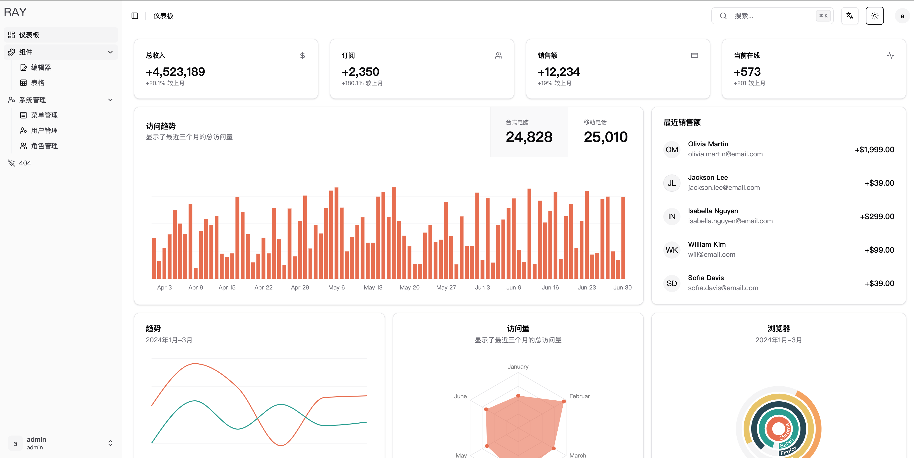

# 简介
Ray是一个免费开源的全栈中后台模板，采用了 Next、TRPC、Prisma、TypeScript 等主流技术开发，开箱即用，可用于中后台全栈开发，也适合学习参考。
<table>
  <tr>
    <td></td>
    <td></td>
  </tr>
   <tr>
    <td></td>
    <td></td>
  </tr>
</table>

# 服务搭建
## 数据库
* 创建.env配置文件
```shell
# 配置数据库连接，以postgres为例
DATABASE_URL="postgres://{用户名}:{密码}@{域名}:{端口}/{库名}"
```
修改/prisma/schema.prisma 到对应数据库类型
```
datasource db {
  provider = "postgres"
  url      = env("DATABASE_URL")
}
```
[其他数据库配置](https://www.prisma.io/docs/reference/database-reference/connection-urls#env)
```shell
# 配置NEXTAUTH_SECRET
NEXTAUTH_SECRET="xxxxxx"
```
```shell
#秘钥生成方式
openssl rand -base64 32
```

* 初始化表结构
```shell
pnpm db:push
```
* 初始化表数据
```shell
pnpm db:seed
```
或者
```shell
node --loader ts-node/esm .\prisma\seed.ts
```
## 本地启动服务
```shell
pnpm i
pnpm dev
```
默认账号：admin/admin@123

## Docker构建
* 创建docker-compose.yml
* 复制docker-compose-example.yml内容到docker-compose.yml
* 修改环境变量
```shell
 environment:
  - DATABASE_URL="xxxx"
  - NEXTAUTH_SECRET="xxxx"
```
* 启动服务
```shell
docker compose up -d
```
注：如需要单独打包镜像使用一下脚本
```shell
docker build -t ray-docker --build-arg NEXT_PUBLIC_CLIENTVAR=clientvar .
```
